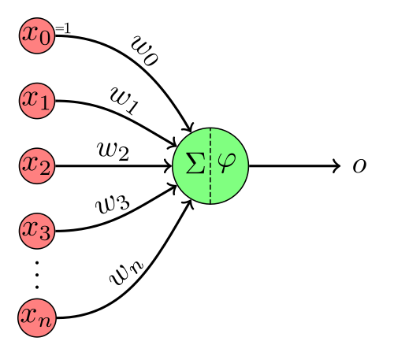

## Note: Project is WIP.

# Implemention of a two-input perceptron in Verilog

This is a Verilog implementation of a perceptron with two inputs and two weights, created as part of an assignment for [ECE 210](https://catalog.ucsc.edu/en/current/general-catalog/courses/ece-electrical-and-computer-engineering/graduate/ece-210) at UC Santa Cruz during the winter 2026 quarter.

## Introduction to perceptrons

A perceptron is a type of artificial neuron used in binary classification models. It takes in an input **x** that is represented as a vector of *n* real numbers.

Each element is multiplied by a respective weight $ w_i $ that determines its importance; all the $ w_ix_i $ terms are then added together to produce a weighted sum. A bias *b* is often added to the weighted sum to enable the model to better fit the data. This final product is passed through an activation function $ f(\cdot) $ that determines the final class:

$$ y = f(\sum_{i = 1}^{n} w_ix_i + b) $$

For binary classification models, the predicted class *y* is usually either $ \{ y : y \in \{-1, 1\}\} $ or $ \{ y : y \in \{0, 1\}\} $. We will use $ \{0, 1\} $ for this project as it seems to be more common.

## To use this code

The code in this project can either be run as a standalone test called from other modules. Please see [docs/info.md](docs/info.md) for additional details.

### Image credits

* Perceptron diagram [[source](https://commons.wikimedia.org/wiki/File:Perceptron-unit.svg)] by Martin Thoma (CC0 1.0)
